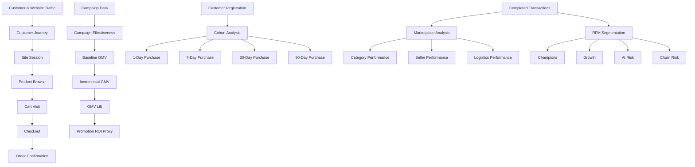
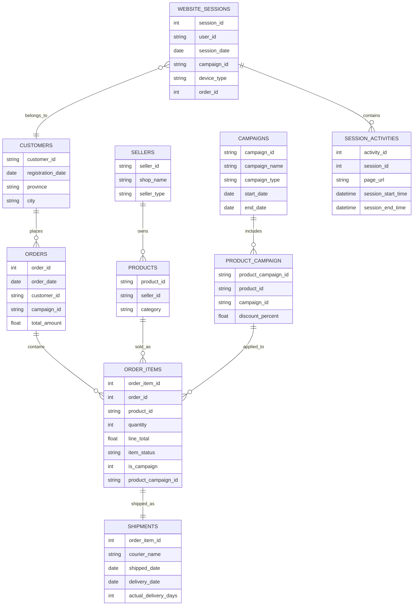
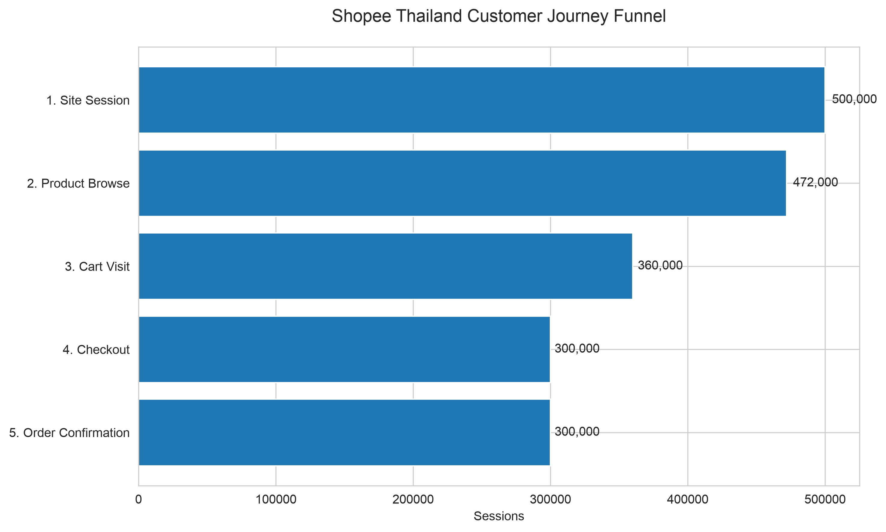
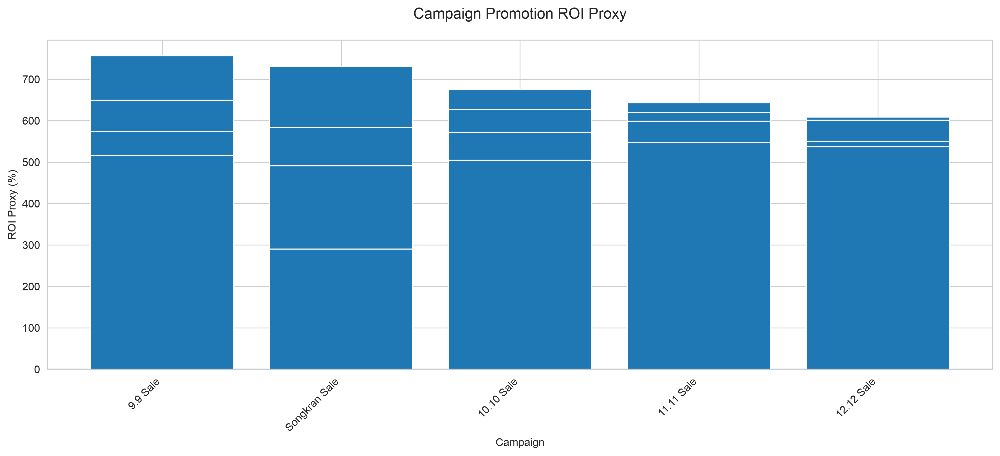
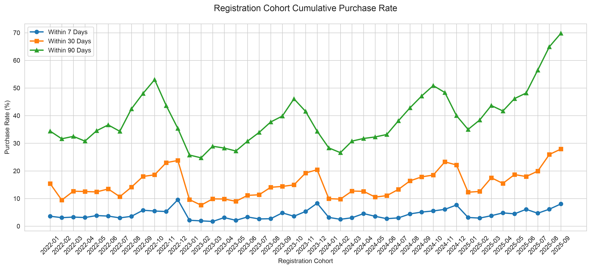
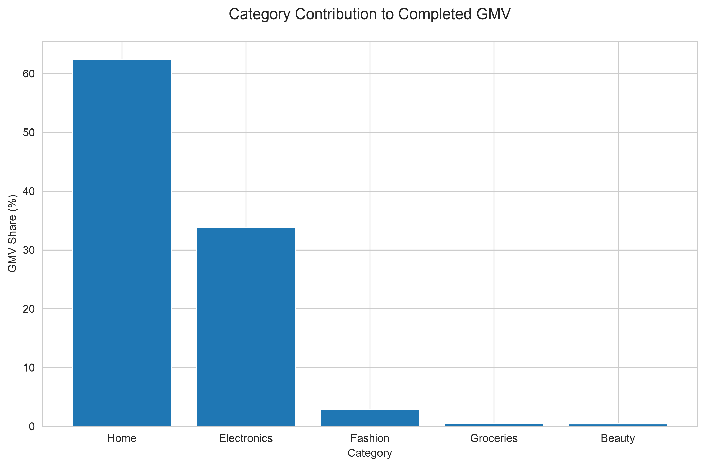
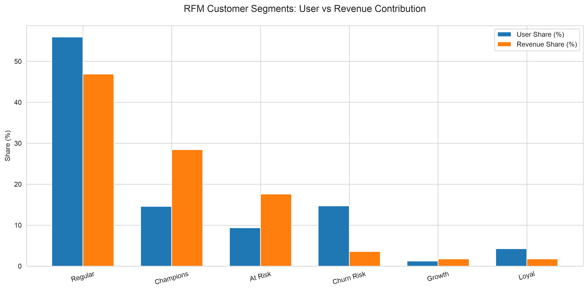
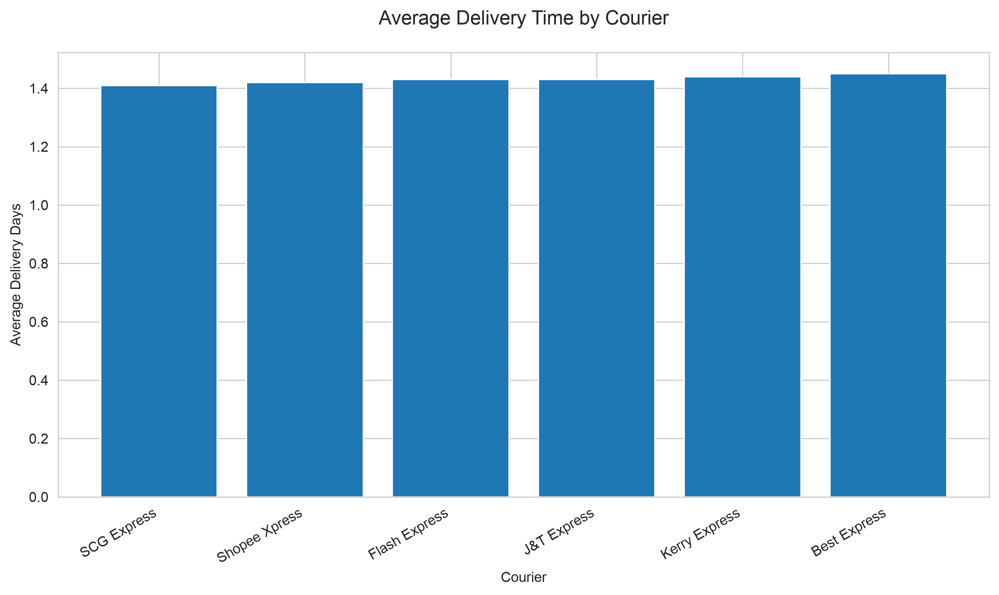

# Shopee Thailand Marketplace & Customer Journey Analytics

An end-to-end e-commerce analytics project built on a synthetic Shopee Thailand dataset, covering **customer journey, campaign effectiveness, cohort purchasing behavior, marketplace/category performance, seller performance, logistics, and RFM customer segmentation**.

> **Dataset:** Shopee TH: Customer Journey & Operations Dataset
> **Important:** The dataset is fully synthetic and is designed for educational, research, and portfolio purposes.

---

## 1. Project Overview

This project analyzes a simulated Shopee Thailand operating environment from both the **customer** and **marketplace** perspectives.

The analysis connects front-end behavioral data with back-end transaction and operational data to answer key e-commerce business questions:

* Where do customers drop off in the purchase journey?
* Which campaigns generate the strongest incremental performance?
* How quickly do newly registered customers convert into purchasers?
* Which product categories drive marketplace GMV?
* Which seller groups generate the most value?
* Which customer segments are most valuable and which require reactivation?
* How consistent is logistics performance across couriers?

The project processes:

| Dataset               |    Volume |
| --------------------- | --------: |
| Customers             |    60,000 |
| Orders                |   300,000 |
| Order Items           |   480,481 |
| Completed Order Items |   360,187 |
| Website Sessions      |   500,000 |
| Session Activities    | 2,696,481 |
| Products              |     4,880 |
| Sellers               |       200 |
| Campaigns             |        20 |

---

## 2. Analytical Framework

The project follows a relational e-commerce analytics framework:



### Data relationship



---

## 3. Business Questions

### Customer Journey

Where is the biggest observed drop-off in the customer journey from browsing to order confirmation?

### Campaign Effectiveness

Which campaigns generate the strongest incremental GMV and promotion efficiency compared with pre-campaign performance?

### Customer Cohorts

How quickly do newly registered customers become purchasing customers, and how does purchasing behavior evolve across registration cohorts?

### Marketplace Structure

Which categories contribute the most GMV, and how concentrated is marketplace performance?

### Seller Performance

How does marketplace output differ between Company and Individual sellers?

### Logistics

How does delivery performance vary across courier providers?

### Customer Value

Which customer segments contribute the most GMV, and which high-value customers may require reactivation?

---

## 4. Analysis Modules

### 4.1 Customer Journey Funnel

The funnel is built at the **session level**, using the page sequence available in the dataset:

```text
Site Session
    ↓
Product Browse
    ↓
Cart Visit
    ↓
Checkout
    ↓
Order Confirmation
```

The dataset records page-level session activity rather than explicit button-click events, so `/cart` is treated as **Cart Visit** rather than "Add to Cart".

### 4.2 Campaign Effectiveness

Campaign performance is evaluated using:

* Campaign GMV
* Net Transaction Value Proxy
* Discount cost
* Pre-campaign baseline GMV
* Incremental GMV
* GMV lift
* Incremental Net Transaction Value Proxy
* Promotion ROI proxy

The analysis uses a **30-day pre-campaign matched baseline** for the same campaign products.

The project defines a Net Transaction Value Proxy as:
Net Transaction Value Proxy = Line Total − Commission Amount − Maintenance Amount
This is a project-level analytical proxy rather than a formal financial accounting measure.

> **Note:** Promotion ROI is a proxy metric rather than full marketing ROI because advertising and other campaign operating costs are not available in the dataset.

### 4.3 Cohort Analysis

Customers are grouped by registration month.

The project measures the cumulative percentage of registered users who complete at least one purchase within:

* 1 day
* 7 days
* 30 days
* 90 days

This metric is intentionally described as **Cumulative Purchase Rate**, rather than classic Day-N active retention.

### 4.4 Category & Seller Analytics

Completed transactions are used to evaluate:

* GMV
* GMV contribution
* Net Transaction Value Proxy
* Net Transaction Value Rate
* Order volume
* Items sold
* Seller productivity

### 4.5 Logistics Analytics

Because the dataset's shipment records are all marked as `Delivered`, delivery success rate is not informative.

Instead, logistics performance focuses on:

* Average delivery days
* Median delivery days
* P90 delivery days
* Courier comparison
* Category comparison

### 4.6 RFM Customer Segmentation

RFM segmentation is based on completed transactions:

* **Recency:** Days since most recent completed purchase
* **Frequency:** Number of completed orders
* **Monetary:** Completed GMV

Customer segments include:

* Champions
* Growth
* At Risk
* Loyal
* Regular
* Churn Risk

---

## 5. Key Findings

### Customer Journey

Across 500,000 sessions:

| Stage              | Sessions | Overall Conversion |
| ------------------ | -------: | -----------------: |
| Site Session       |  500,000 |             100.0% |
| Product Browse     |  472,000 |              94.4% |
| Cart Visit         |  360,000 |              72.0% |
| Checkout           |  300,000 |              60.0% |
| Order Confirmation |  300,000 |              60.0% |

The largest observed stage drop-off occurs at **Cart Visit**, with a **23.73% drop from the preceding funnel stage**.

### Campaign Effectiveness

The campaign analysis identifies:

* Highest Promotion ROI Proxy: **9.9 Sale — 756.64%**
* Lowest Promotion ROI Proxy: **Songkran Sale — 290.49%**

Campaign performance is benchmarked against a 30-day pre-campaign baseline for the same products.

### Cohort Purchasing Behavior

Average cumulative purchase rates across valid cohorts:

| Window         | Purchase Rate |
| -------------- | ------------: |
| Within 1 Day   |         1.18% |
| Within 7 Days  |         4.23% |
| Within 30 Days |        15.16% |
| Within 90 Days |        38.91% |

Later registration cohorts generally show stronger cumulative purchase rates than earlier cohorts, indicating an improvement in simulated customer conversion over the observation period.

### Marketplace Concentration

The marketplace is highly concentrated:

* **Home:** 62.38% of completed GMV
* **Electronics:** 33.84%
* **Home + Electronics:** **96.22%**

This suggests substantial GMV dependency on two core categories.

### Seller Performance

Company sellers:

* 150 sellers
* Average GMV per seller: **15.73M**

Individual sellers:

* 50 sellers
* Average GMV per seller: **13.91M**

Company sellers generate approximately **13.1% higher average GMV per seller** than Individual sellers.

### RFM Customer Value

The largest value concentration is observed among high-value segments:

| Segment    | User Share |     GMV Share |
| ---------- | ---------: | ------------: |
| Regular    |     55.92% |        46.90% |
| Champions  |     14.57% |        28.43% |
| At Risk    |      9.35% |        17.59% |
| Churn Risk |     14.68% |         3.55% |
| Growth     |      1.22% |         1.77% |
| Loyal      |      4.26% |         1.76% |

Two segments are particularly important:

* **Champions:** 14.57% of customers generate 28.43% of completed GMV.
* **At Risk:** 9.35% of customers generate 17.59% of completed GMV, highlighting a meaningful reactivation opportunity.

---

## 6. Visualizations

### Customer Journey Funnel



### Campaign Effectiveness



### Cohort Purchase Rate



### Category GMV Concentration



### RFM Segmentation



### Courier Performance



---

## 7. Technical Stack

* **Python**
* **Pandas**
* **NumPy**
* **Matplotlib**
* **Seaborn**
* Relational data analysis
* Customer segmentation
* Cohort analysis
* E-commerce funnel analysis
* Campaign effectiveness analysis

---

## 8. Project Structure

```text
shopee-th-operations-analytics/
│
├── Data/
│   ├── shopee_campaigns_thailand.csv
│   ├── shopee_customers_thailand.csv
│   ├── shopee_order_items_thailand.csv
│   ├── shopee_orders_thailand.csv
│   ├── shopee_product_campaign_thailand.csv
│   ├── shopee_products_thailand.csv
│   ├── shopee_reviews_thailand.csv
│   ├── shopee_sellers_thailand.csv
│   ├── shopee_session_activities_thailand.csv
│   ├── shopee_shipments_thailand.csv
│   └── shopee_website_sessions_thailand.csv
│
├── Images/
│   ├── 01_customer_journey_funnel.png
│   ├── 02_campaign_roi.png
│   ├── 03_cohort_purchase_rate.png
│   ├── 04_category_gmv_share.png
│   ├── 05_rfm_segments.png
│   └── 06_courier_delivery.png
│
├── Notebook/
│   └── shopee_analysis.ipynb
│
├── Results/
│   ├── funnel_analysis.csv
│   ├── campaign_attribution_summary.csv
│   ├── campaign_period_performance.csv
│   ├── campaign_performance.csv
│   ├── cohort_purchase_rate.csv
│   ├── category_analysis.csv
│   ├── seller_analysis.csv
│   ├── seller_type_analysis.csv
│   ├── courier_analysis.csv
│   ├── logistics_category_analysis.csv
│   ├── rfm_customers.csv
│   └── rfm_segment_summary.csv
│
└── README.md
```

---

## 9. How to Run

### 1. Clone the repository

```bash
git clone <your-repository-url>
cd shopee-th-operations-analytics
```

### 2. Install dependencies

```bash
pip install pandas numpy matplotlib seaborn
```

### 3. Place the dataset

Store the 11 CSV files under:

```text
Data/
```

### 4. Open the notebook

```text
Notebook/shopee_analysis.ipynb
```

Update the data path if necessary:

```python
DATA_PATH = "../Data/"
```

### 5. Run all cells

The notebook will generate:

* analytical tables under `Results/`
* visualization files under `Images/`

---

## 10. Data Quality

The project includes primary-key and foreign-key validation.

Observed checks:

* No duplicate primary keys
* No missing customers referenced by orders
* No missing orders referenced by order items
* No missing product-campaign references
* Completed transaction records contain valid category and seller mappings
* Discount calculations are internally consistent with the recorded discount percentage

The dataset follows a relational 11-table architecture and is specifically designed to support e-commerce customer journey and operations analysis.

---

## 11. Limitations

This project uses a **100% synthetic dataset**. The data is designed to simulate a realistic e-commerce environment, so findings should be interpreted as analytical insights from the simulated marketplace rather than actual Shopee business performance.

Additional limitations include:

* Campaign ROI is a proxy because advertising and operational campaign costs are unavailable.
* The Net Transaction Value Proxy is a project-defined analytical metric, not a formal platform revenue or accounting measure.
* Funnel analysis is based on page-level session activities rather than explicit clickstream events.
* `Cart Visit` should not be interpreted as an explicit "Add to Cart" click.
* Cohort metrics measure cumulative purchase behavior rather than traditional Day-N active retention.
* Shipment records contain delivered orders only, so delivery failure rates cannot be evaluated.

---

## 12. Conclusion

This project demonstrates an end-to-end approach to e-commerce analytics by connecting:

```text
Customer Journey
        ↓
Conversion
        ↓
Campaign Effectiveness
        ↓
Customer Purchase Behavior
        ↓
Customer Value
        ↓
Marketplace Structure
        ↓
Seller & Logistics Operations
```

The analysis combines behavioral, transactional, customer, campaign, marketplace, and operational data to identify actionable opportunities across **growth, CRM, marketplace management, and operations**.

---

### Dataset

Shopee TH: Customer Journey & Operations Dataset
Created by Hnin Shwe Zin Hlaing on Kaggle.

> This project uses the dataset for educational and portfolio purposes.
